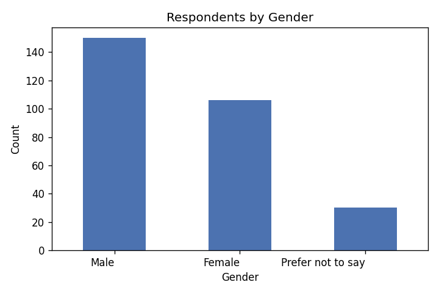
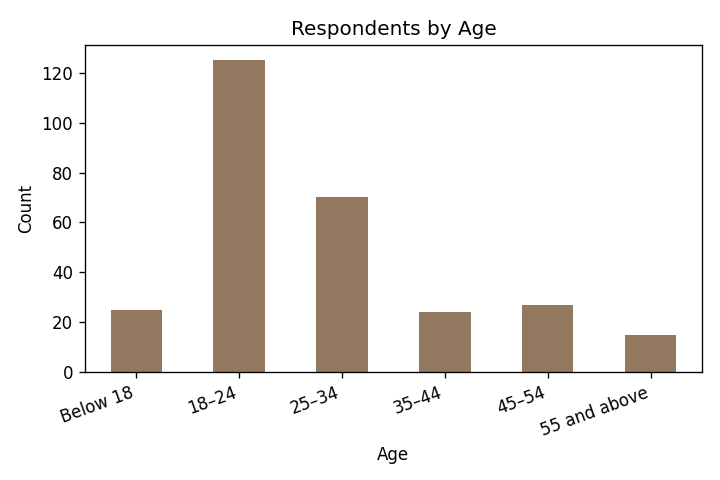
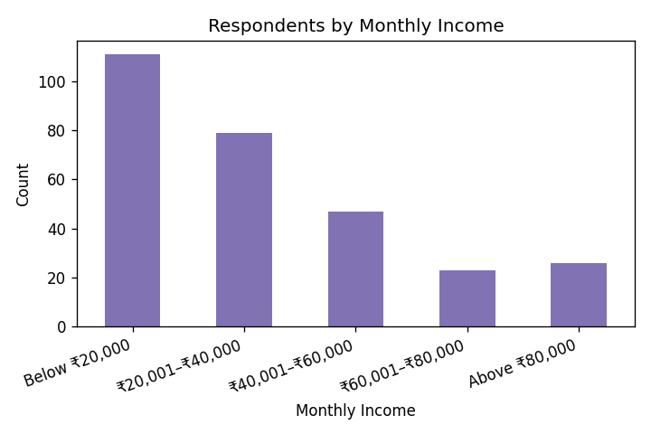
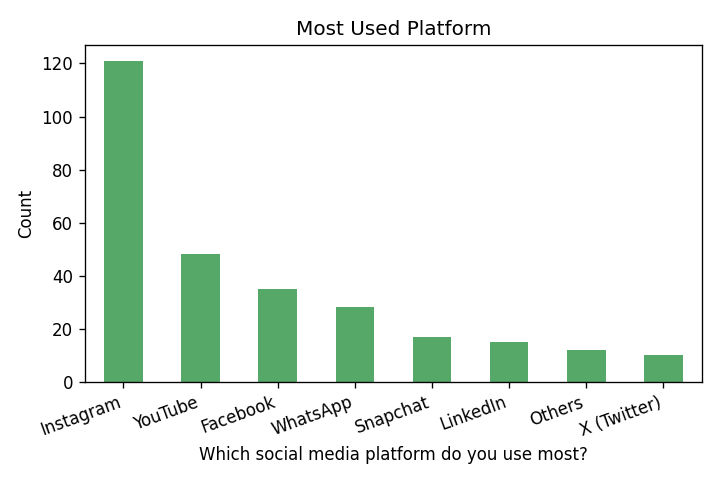
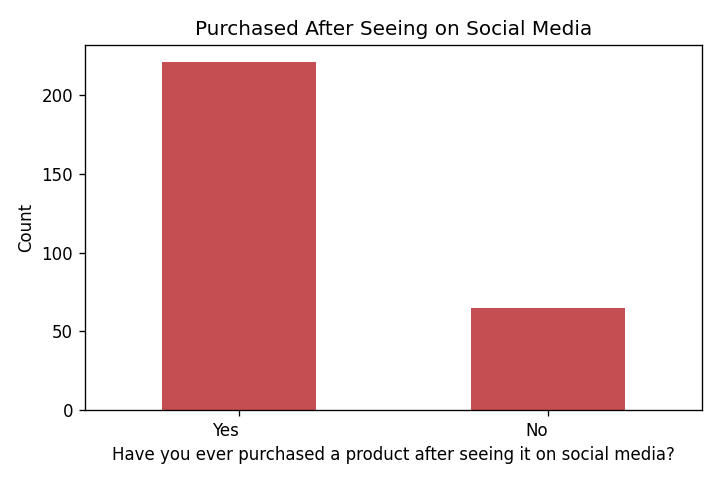
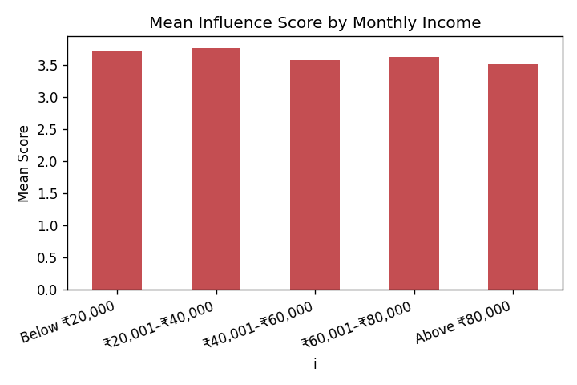
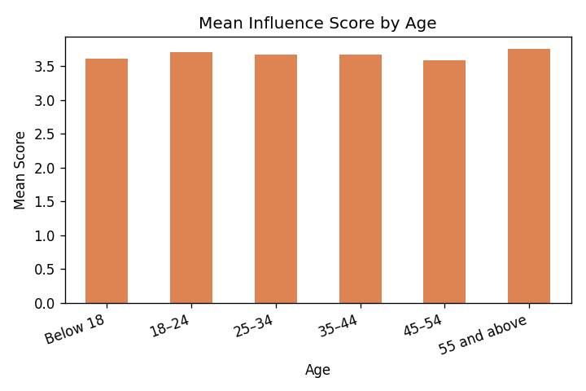

# Impact of Social Media on Consumer Buying Behaviour

A research project based on primary data from **321 respondents** (of whom **286 gave informed
consent** and were analysed), studying how social media influences buying behaviour. Analysed using
percentage analysis, an independent-samples **t-test**, one-way **ANOVA**, and correlation.

> 📄 **The full formatted report for submission is in [`Social_Media_Research_Report.docx`](Social_Media_Research_Report.docx)** (Times New Roman, 1.5 spacing, title page, 16 tables, 7 charts). This README is a readable summary for viewing on GitHub.

---

## Table of Contents
1. [Introduction](#chapter-1-introduction)
2. [Review of Literature](#chapter-2-review-of-literature)
3. [Research Methodology](#chapter-3-research-methodology)
4. [Data Analysis and Interpretation](#chapter-4-data-analysis-and-interpretation)
5. [Findings, Conclusion and Summary](#chapter-5-findings-conclusion-and-summary)

---

## Chapter 1: Introduction
Social media platforms such as Instagram, YouTube and Facebook have evolved into powerful commercial
ecosystems where consumers discover products through influencers, user-generated content, reviews,
and targeted ads. This study measures how strongly social media influences buying behaviour and
whether that influence varies by gender, age, and income.

**Objectives**
1. To study the social media usage pattern of respondents.
2. To examine the influence of social media on consumer buying behaviour.
3. To analyse the role of influencers, ads, reviews, and promotions.
4. To test whether influence differs between male and female consumers.
5. To test whether influence differs across income groups.
6. To offer suggestions to marketers and consumers.

---

## Chapter 2: Review of Literature
16 genuine studies from 2016–2026 were reviewed. Examples:
- **Meta-analysis of influencers (2023)** — influencer credibility affects purchase intention most. [Source](https://www.mdpi.com/2071-1050/15/3/2744)
- **Social media advertising & consumer behaviour (2025)** — credibility, authenticity and sustainability boost purchase intention, mediated by trust. [Source](https://www.frontiersin.org/journals/communication/articles/10.3389/fcomm.2025.1595796/full)
- **Online influencers in Indian clothing sector (2026)** — younger consumers and students most influenced; lower-income consumers focus on discounts. [Source](https://link.springer.com/10.1007/978-3-032-10016-0_59)
- **"From scroll to sale" (2025)** — social media triggers predict buying behaviour; influencer credibility showed no significant effect (influencer fatigue). [Source](https://www.frontiersin.org/journals/communication/articles/10.3389/fcomm.2025.1664694/full)

*(Full list of 16 references with links is in Appendix II of the report.)*

**Research Gap:** Few studies test the *combined* influence of multiple social media factors on
buying behaviour while also checking differences across gender and income in one Indian sample.

---

## Chapter 3: Research Methodology

| Element | Detail |
|---|---|
| Research design | Descriptive |
| Data sources | Primary (questionnaire), Secondary (journals) |
| Sampling | Convenience sampling |
| Responses received | 321 |
| **Valid sample (after consent filter)** | **286** (35 non-consenting excluded) |
| Instrument | Demographics + 21-item Likert (1–5) scale |
| Tools | Percentage analysis, mean/SD, t-test, ANOVA, correlation, Cronbach's alpha |

**Hypotheses**
- **H0₁:** No significant difference in influence between male and female respondents.
- **H0₂:** No significant difference in influence across income groups.

---

## Chapter 4: Data Analysis and Interpretation

### 4.1 Respondent Profile (n = 286)

| Gender | n | % |
|---|---|---|
| Male | 150 | 52.4 |
| Female | 106 | 37.1 |
| Prefer not to say | 30 | 10.5 |

| Age | n | % |
|---|---|---|
| 18–24 | 125 | 43.7 |
| 25–34 | 70 | 24.5 |
| 45–54 | 27 | 9.4 |
| Below 18 | 25 | 8.7 |
| 35–44 | 24 | 8.4 |
| 55 and above | 15 | 5.2 |

| Monthly Income | n | % |
|---|---|---|
| Below ₹20,000 | 111 | 38.8 |
| ₹20,001–₹40,000 | 79 | 27.6 |
| ₹40,001–₹60,000 | 47 | 16.4 |
| Above ₹80,000 | 26 | 9.1 |
| ₹60,001–₹80,000 | 23 | 8.0 |

**Most used platform:** Instagram 42.3%, YouTube 16.8%, Facebook 12.2%.

**Purchased after seeing on social media:** **Yes 77.3%**, No 22.7%.

**Top product categories:** Fashion & Clothing 29.7%, Electronics 23.4%, Beauty & Personal Care 15.4%.

### 4.2 Influence Statements
All 21 statements scored above the neutral 3 (range 3.59–3.81). **Overall mean influence score = 3.68**,
showing an above-average influence of social media on buying behaviour.

### 4.3 Reliability
Cronbach's alpha (21 items) = **0.533** — moderate; acceptable for exploratory research, noted as a limitation.

### 4.4 T-Test — Influence by Gender ✅ Significant
| Gender | N | Mean | SD |
|---|---|---|---|
| Male | 150 | 3.663 | 0.391 |
| Female | 106 | 3.759 | 0.306 |

**t = −2.201, p = 0.029 → Reject H0.** Females are significantly more influenced than males.

### 4.5 ANOVA — Influence by Income ✅ Significant
| Income | N | Mean | SD |
|---|---|---|---|
| Below ₹20,000 | 111 | 3.719 | 0.327 |
| ₹20,001–₹40,000 | 79 | 3.757 | 0.369 |
| ₹40,001–₹60,000 | 47 | 3.570 | 0.379 |
| ₹60,001–₹80,000 | 23 | 3.619 | 0.423 |
| Above ₹80,000 | 26 | 3.505 | 0.447 |

**F = 3.854, p = 0.005 → Reject H0.** Lower-income consumers are significantly more influenced.

### 4.6 Supplementary ANOVA — Influence by Age (not significant)
**F = 0.720, p = 0.609 → Accept H0.** Influence is uniform across age groups.

### 4.7 Correlation — Daily Time vs Influence
Spearman **rho = 0.046, p = 0.436** — negligible. More hours online does not by itself mean more influence.

---

## Chapter 5: Findings, Conclusion and Summary

**Major Findings**
- 286 of 321 consented and were analysed; sample is young (43.7% are 18–24) and student-heavy (41.6%).
- Instagram dominant (42.3%); 77.3% have purchased via social media; Fashion & Electronics lead.
- Overall influence above average (mean 3.68); all 21 items above neutral.
- **Significant gender difference** (t = −2.201, p = 0.029) — females more influenced.
- **Significant income difference** (F = 3.854, p = 0.005) — lower-income more influenced.
- No significant age difference (F = 0.720, p = 0.609); negligible time–influence correlation.
- Moderate scale reliability (α = 0.53), noted as a limitation.

**Conclusion** — Social media exerts an above-average and *differentiated* influence on buying
behaviour: significantly stronger among female and lower-income consumers, uniform across ages.
Product comparison, social proof, and advertisements are the strongest drivers, while time spent is
not. Businesses should tailor social media strategies to specific demographic segments.

---

### Reproducing the analysis
Scripts: `analyze_real2.py` (analysis) and `build_report2.py` (document generation), using Python
with `pandas`, `scipy`, `matplotlib`, `python-docx`. Data: `survey_responses.csv` (321 records;
analysis filters to the 286 consenting respondents).

*Academic integrity: all statistics are the true results of the survey responses. Non-consenting
respondents were ethically excluded. No data were altered or fabricated.*
