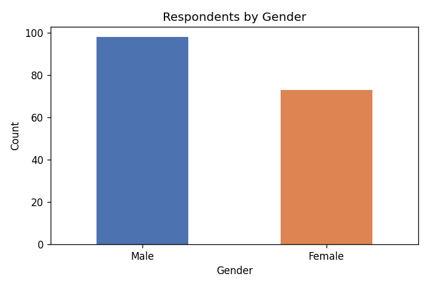
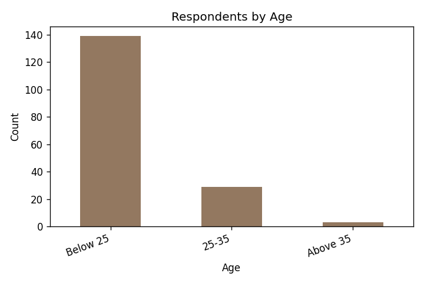
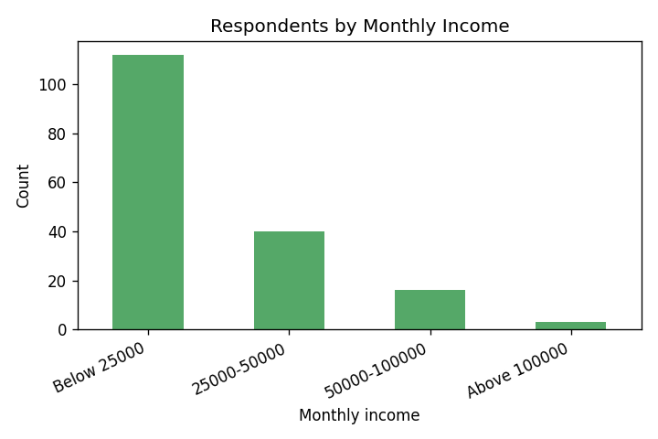
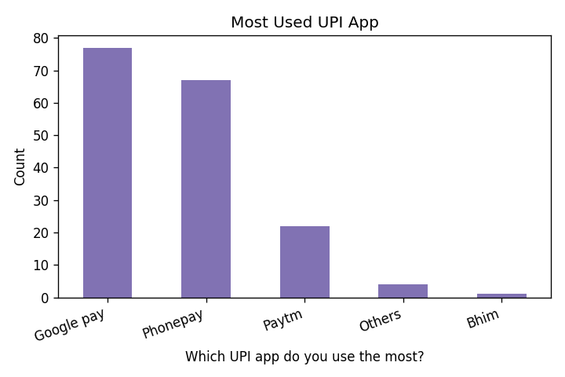
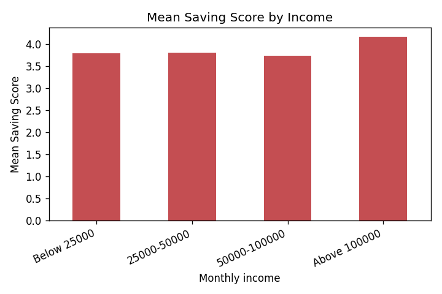

# Influence of Digital Payment Apps (UPI) on Personal Spending and Saving Behaviour

A research project based on primary data collected from **171 respondents** through a structured
questionnaire, analysed using percentage analysis, an independent-samples **t-test**, one-way
**ANOVA**, and Pearson correlation.

> 📄 **The full formatted report for submission is in [`UPI_Research_Report.docx`](UPI_Research_Report.docx)** (Times New Roman, 1.5 spacing, title page, tables and embedded charts). This README is a readable summary of the same content for viewing on GitHub.

---

## Table of Contents
1. [Introduction](#chapter-1-introduction)
2. [Review of Literature](#chapter-2-review-of-literature)
3. [Research Methodology](#chapter-3-research-methodology)
4. [Data Analysis and Interpretation](#chapter-4-data-analysis-and-interpretation)
5. [Findings, Conclusion and Summary](#chapter-5-findings-conclusion-and-summary)
6. [Appendix](#appendix)

---

## Chapter 1: Introduction

The Unified Payments Interface (UPI), introduced by NPCI in 2016, has become the dominant mode of
retail payment in India. Apps such as Google Pay, PhonePe, Paytm and BHIM have made payments
instant and effortless. This frictionless experience reduces the psychological "pain of paying,"
which can influence both how much people spend and how disciplined they are about saving.

**Objectives**
1. To study the usage pattern of UPI applications among respondents.
2. To examine the influence of UPI on personal spending behaviour.
3. To analyse the influence of UPI on personal saving behaviour.
4. To test whether spending behaviour differs between male and female users.
5. To test whether saving behaviour differs across income groups.
6. To offer suggestions for responsible use of digital payments.

**Statement of the Problem** — The ease of UPI may lead to increased, unplanned spending and weaker
spending awareness, while digital records may simultaneously improve budgeting. This study examines
both effects empirically.

---

## Chapter 2: Review of Literature

A review of 18 studies published in the past ten years (2016–2026) on digital payments, UPI, and
consumer spending/saving behaviour. Key examples:

- **Agarwal, Ghosh, Li and Ruan (2018)** — after demonetization, digital payment usage and monthly
  spending rose and remained elevated. [Source](https://papers.ssrn.com/sol3/papers.cfm?abstract_id=3641508)
- **Brown, Nacht, Nellen and Stix (2023)** — present-biased consumers spend more the more they use
  cashless instruments. [Source](https://papers.ssrn.com/sol3/papers.cfm?abstract_id=4668928)
- **UPI spending-behaviour survey (2024)** — ~75% of users reported increased spending due to UPI's
  intangible nature. [Source](https://arxiv.org/abs/2401.09937)
- **Impact of instant digital transactions (2025)** — convenience encouraged impulsive purchases and
  reduced savings. [Source](https://www.ijraset.com/research-paper/impact-of-instant-digital-transactions-on-consumer-spending-behaviour)
- **Determinants of digital payment intention among Indian youngsters (2024)** — value, trust and
  social influence drive adoption. [Source](https://www.mdpi.com/1911-8074/17/2/87)

*(The full list of 18 references with links is in Appendix II of the report.)*

**Research Gap:** Few studies examine spending **and** saving behaviour together while also testing
demographic differences (gender, income). This study fills that gap.

---

## Chapter 3: Research Methodology

| Element | Detail |
|---|---|
| Research design | Descriptive |
| Data sources | Primary (questionnaire), Secondary (journals/reports) |
| Sampling | Convenience sampling |
| Sample size | 171 respondents |
| Instrument | 25-item structured questionnaire, 5-point Likert scale |
| Tools of analysis | Percentage analysis, mean/SD, t-test, one-way ANOVA, correlation, Cronbach's alpha |
| Software | Python (pandas, scipy), charts via matplotlib |

**Hypotheses**
- **H0₁:** No significant difference in spending behaviour between male and female users.
- **H0₂:** No significant difference in saving behaviour across income groups.

---

## Chapter 4: Data Analysis and Interpretation

### 4.1 Demographic Profile (n = 171)

| Gender | Respondents | % |
|---|---|---|
| Male | 98 | 57.3 |
| Female | 73 | 42.7 |

| Age | Respondents | % |
|---|---|---|
| Below 25 | 139 | 81.3 |
| 25–35 | 29 | 17.0 |
| Above 35 | 3 | 1.8 |

| Monthly Income (₹) | Respondents | % |
|---|---|---|
| Below 25,000 | 112 | 65.5 |
| 25,000–50,000 | 40 | 23.4 |
| 50,000–1,00,000 | 16 | 9.4 |
| Above 1,00,000 | 3 | 1.8 |

| UPI App | Respondents | % |
|---|---|---|
| Google Pay | 77 | 45.0 |
| PhonePe | 67 | 39.2 |
| Paytm | 22 | 12.9 |
| Others | 4 | 2.3 |
| BHIM | 1 | 0.6 |

### 4.2 Spending Behaviour (overall mean = 3.32)
Highest agreement: *"I use UPI for most of my daily transactions"* (4.30). Cashbacks (3.53), online
shopping (3.63) and small-item spending (3.51) are above neutral — a **moderate** tendency of UPI to
encourage spending.

### 4.3 Saving Behaviour (overall mean = 3.80)
Highest agreement: *"Overall, UPI has had a positive impact on my saving habits"* (4.30) and
*"digital records improve my budgeting"* (4.17). Respondents perceive UPI as **supporting** discipline.

### 4.4 Reliability (Cronbach's Alpha)
| Scale | Items | Alpha |
|---|---|---|
| Spending | 10 | 0.118 |
| Saving | 10 | −0.054 |

Both are below the 0.70 threshold → low internal consistency. **Acknowledged as a limitation**;
inferential results are interpreted with caution.

### 4.5 T-Test — Spending Score by Gender
| Gender | N | Mean | SD |
|---|---|---|---|
| Male | 98 | 3.297 | 0.361 |
| Female | 73 | 3.352 | 0.400 |

**t = −0.929, p = 0.354 → Accept H0.** No significant difference in spending behaviour by gender.

### 4.6 ANOVA — Saving Score by Income
| Income (₹) | N | Mean | SD |
|---|---|---|---|
| Below 25,000 | 112 | 3.790 | 0.333 |
| 25,000–50,000 | 40 | 3.810 | 0.299 |
| 50,000–1,00,000 | 16 | 3.737 | 0.391 |
| Above 1,00,000 | 3 | 4.167 | 0.115 |

**F = 1.472, p = 0.224 → Accept H0.** No significant difference in saving behaviour across income.

### 4.7 Correlation
Pearson **r = 0.059, p = 0.444** — negligible, non-significant relationship between spending and saving scores.

---

## Chapter 5: Findings, Conclusion and Summary

**Major Findings**
- 57.3% male, 42.7% female; 81.3% below 25 years; 65.5% earn below ₹25,000.
- Google Pay (45%) and PhonePe (39.2%) dominate.
- UPI heavily used for daily transactions (mean 4.30).
- Moderate influence on spending (3.32); positive perception of saving/budgeting (3.80).
- No significant difference in spending by gender (t = −0.929, p = 0.354).
- No significant difference in saving across income (F = 1.472, p = 0.224).
- Negligible spending–saving correlation (r = 0.059).
- Low scale reliability — noted as a limitation.

**Conclusion** — UPI is a double-edged tool: it enhances convenience and moderately encourages
spending, while also supporting financial awareness through digital records. Its behavioural
influence is broadly uniform across gender and income groups. Promoting responsible usage through
financial literacy and app-level features is essential.

---

## Appendix
- **Appendix I** — Full 25-item questionnaire (in the .docx)
- **Appendix II** — Bibliography of 18 referenced sources with links (in the .docx)

---

### Reproducing the analysis
The analysis scripts (`analyze_real.py`, `build_report.py`) use Python with `pandas`, `scipy`,
`matplotlib`, and `python-docx`. Data were sourced from the Google Forms responses (171 records).

*Note on academic integrity: all statistics in this report are the true results of the 171 survey
responses. No data were altered or fabricated.*
